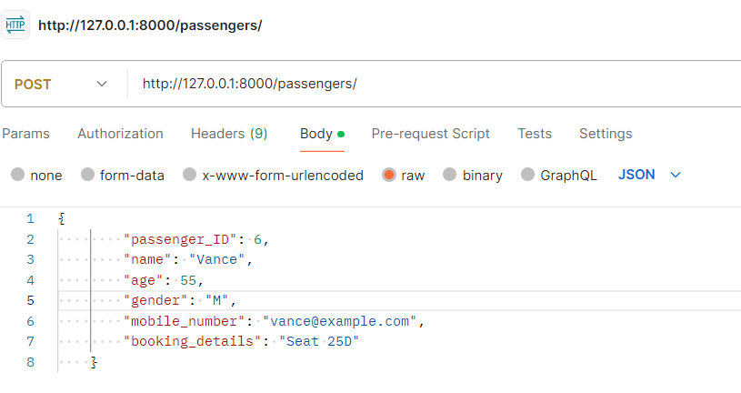

# Django Passenger Details CRUD

This Django project, built using function-based views, serves as a platform to manage passenger details effectively. It provides CRUD (Create, Read, Update, Delete) functionality for storing and manipulating passenger information such as name, age, gender, mobile number, and booking details.

## Features

- Add new passenger details
- View the list of all passengers
- Update existing passenger information
- Delete passenger records

## Prerequisites

Ensure you have the following installed:

- Python (3.x recommended)
- Django (5.0.2 used in this project)
- Django REST framework
- PostgreSQL (or any other database you prefer, with respective settings adjustments)

## Setup and Installation

1. **Clone the repository:**

    ```bash
    git clone <repository-url>
    cd Passenger
    ```

2. **Install required packages:**

    ```bash
    pip install -r requirements.txt
    ```

3. **Configure the database:**

    Edit the `settings.py` file to update your database settings under the `DATABASES` configuration.

    Example for PostgreSQL:

    ```python
    DATABASES = {
        'default': {
            'ENGINE': 'django.db.backends.postgresql',
            'NAME': 'yourdatabasename',
            'USER': 'postgres',
            'PASSWORD': 'yourpassword',
            'HOST': 'localhost',
            'PORT': 'yourportnumber',
        }
    }
    ```

4. **Apply migrations:**

    ```bash
    python manage.py makemigrations
    python manage.py migrate
    ```

5. **Creating a Superuser:**

    To access the Django admin panel and perform administrative tasks, you need to create a superuser account. Run the following command:

    ```bash
    python manage.py createsuperuser
    ```

6. **Running the Server:**

    To start the development server and run the application locally, navigate to the project directory and execute the following command:

    ```bash
    python manage.py runserver
    ```

    After launching the server, navigate to [http://localhost:8000/](http://localhost:8000/) in your preferred web browser. From there, you'll be able to create, read, update, and delete passenger details using the provided function-based views.

## Testing with Postman

You can also test the API endpoints using Postman, a popular API client. Follow these steps to test the endpoints:

1. Open Postman and create a new request.
2. Set the request type (GET, POST, PUT, DELETE) and enter the endpoint URL (e.g., `http://localhost:8000/passengers/` for listing all passengers).
3. Add any necessary headers or request body parameters.
4. Send the request and inspect the response.
### Example: POST Request

Here's an example of a POST request to create a new passenger:



## Admin Interface

Visit [http://localhost:8000/admin/](http://localhost:8000/admin/) to manage passengers using the Django admin site.

## API Endpoints

In addition to the web interface, you can also interact with your CRUD project programmatically through the following API endpoints:

- **List Passengers**: `/passengers/` (GET)
- **Create Passenger**: `/passengers/` (POST)
- **Retrieve Passenger**: `/passengers/<passenger_id>/` (GET)
- **Update Passenger**: `/passengers/<passenger_id>/` (PUT, )
- **Delete Passenger**: `/passengers/<passenger_id>/` (DELETE)

Replace `<passenger_id>` with the ID of the passenger you want to retrieve, update, or delete.

## SQL Queries and Sample Data

To help you get started with testing or exploring the database structure, I've provided a SQL file (`passenger_queries.sql`) with sample queries and data.

